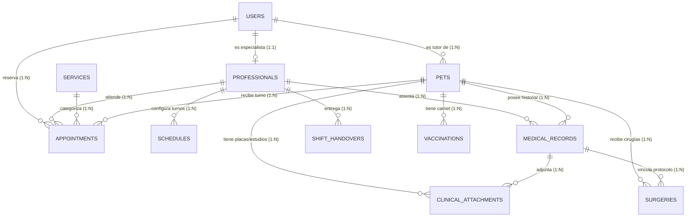

# 🐾 MedVet — Sistema Integral de Gestión Veterinaria, Reservas, EHR & Guardia 24/7

Sistema web integral de alta gama diseñado para clínicas veterinarias, hospitales 24 horas y centros de especialidades. Permite la autogestión de citas médicas por parte de tutores, administración de salas de espera, historias clínicas electrónicas (EHR), visor médico de radiografías (RX), carnet sanitario con código QR dinámico y un módulo de relevo y pase de guardia 24/7.

---

## 🌟 Características Principales

### 1. 📅 Gestión de Citas & Reservas Inteligentes
- **Flujo de reserva en 4 pasos**: Selección de mascota o tutor, servicio veterinario, especialista médico, fecha y franja horaria interactiva.
- **Validación de disponibilidad en tiempo real**: Prevención de solapamiento de turnos y sincronización con agendas de veterinarios.
- **Historial de citas y cancelaciones**: Estados en vivo (*Pendiente*, *Confirmada*, *En Atención*, *Completada*, *Cancelada*).

### 2. 🩺 Historia Clínica Electrónica (EHR) & Evolución
- **Anamnesis y motivo de consulta**: Registro de síntomas, evolución cronológica y hallazgos al examen clínico.
- **Monitoreo de constantes fisiológicas**: Registro de peso (kg), temperatura (°C), frecuencia cardíaca (lpm), frecuencia respiratoria (rpm), estado de mucosas y tiempo de llenado capilar (TLLC).
- **Diagnósticos y prescripciones**: Diagnóstico presuntivo, definitivo, plan terapéutico y receta farmacológica estructurada con posología y firma digital.

### 3. 🩻 Visor Médico de Placas RX & Estudios Complementarios
- **Visualizador interactivo de alta resolución**: Diseñado específicamente para radiografías, ecografías, hemogramas y biopsias.
- **Herramientas de diagnóstico por imagen**:
  - 🔍 **Zoom dinámico**: De 50% a 400% con paneo y reset.
  - 🌓 **Inversión de contraste RX**: Modo negativo radiológico de alta definición para inspección ósea.
  - ⬛ **Filtro monocromo radiológico**: Escala de grises clínica.
  - ↻ **Rotación libre (90°/180°/270°)**: Para orientar placas en incidencias laterales, ventrodorsales o dorsoventrales.
  - 📥 **Descarga y uploader**: Carga en base64 con almacenamiento optimizado en servidor.

### 4. 🪪 Pasaporte Sanitario & Carnet Digital con Código QR Dinámico
- **Acceso público y seguro sin login (`/carnet/:id`)**: Permite a cualquier veterinario, inspector sanitario o tutor escanear el QR con su smartphone o cámara web para consultar el historial verificado en tiempo real.
- **Esquema de vacunación y desparasitación**: Dosis aplicadas, número de lote, laboratorio fabricante y cálculo automático de fecha de revacunación.
- **Credencial imprimible A4 / Plegable**: Generación de credencial sanitaria en formato oficial.

### 5. 🚨 Tablero de Guardia 24/7 & Entrega de Turno (Shift Handover)
- **Monitoreo de boxes de hospitalización y UCI**: Pacientes en observación, postquirúrgicos y alertas críticas de fluidoterapia o medicación.
- **Actas oficiales de entrega de guardia**: Registro del parte médico de salida, conteo de ingresos, cirugías, urgencias atendidas, pacientes dados de alta y tareas pendientes para el veterinario entrante.
- **Impresión de parte de guardia**: Generación de reportes clínicos imprimibles.

---

## 🛠️ Stack Tecnológico

| Capa | Tecnología | Descripción |
| :--- | :--- | :--- |
| **Frontend** | [Nuxt 3/4](https://nuxt.com/) + Vue 3 | Framework SSR/SPA de alto rendimiento |
| **Estilos & UI** | Tailwind CSS + CSS Scoped Tokens | Diseño estético Dark/Light moderno y responsivo |
| **State Management** | [Pinia](https://pinia.vuejs.org/) | Gestión de estados de autenticación y citas |
| **Backend API** | [FeathersJS v5 (Dove)](https://feathersjs.com/) | API REST & WebSockets en TypeScript |
| **Base de Datos** | [PostgreSQL 16+](https://www.postgresql.org/) | Base de datos relacional robusta |
| **Query Builder / ORM** | [Knex.js](https://knexjs.org/) | Migraciones y seeds versionados |
| **Caché & Sesiones** | [Redis 7](https://redis.io/) | Almacenamiento rápido en memoria |
| **Infraestructura** | Docker & Docker Compose | Orquestación de servicios en contenedores |

---

## 🗄️ Arquitectura de Base de Datos (11 Entidades)



Para ver la documentación completa y detallada de tipos de datos, restricciones e índices, consulte [`docs/DATABASE_SCHEMA.md`](./docs/DATABASE_SCHEMA.md).

---

## 🚀 Puesta en Marcha Local

### Prerrequisitos
- Node.js >= 20.x
- Docker y Docker Compose
- Git

### 1. Clonar el Repositorio
```bash
git clone https://github.com/jav978/medvet.git
cd medvet
```

### 2. Configurar Variables de Entorno
```bash
cp .env.example .env
```

### 3. Iniciar Contenedores de Infraestructura (PostgreSQL & Redis)
```bash
docker compose up -d postgres redis
```

### 4. Instalar Dependencias & Migrar Base de Datos
```bash
# Backend
cd medvet-backend
npm install
npm run migrate
npm run seed
npm run dev

# Frontend (en otra terminal)
cd ../medvet-frontend
npm install
npm run dev
```

O utilice el script de conveniencia automatizado:
```bash
./dev.sh
```

---

## 🌐 Servicios y Puertos

| Servicio | URL Local | Descripción |
| :--- | :--- | :--- |
| **Frontend Web** | `http://localhost:3000` | Aplicación Nuxt 3 (Tutores, Citas, EHR, Guardia) |
| **API Backend** | `http://localhost:3030` | Endpoints FeathersJS REST & WS |
| **Carnet QR Público** | `http://localhost:3000/carnet/:id` | Validación y pasaporte sanitario digital |
| **PostgreSQL** | `localhost:5432` | Base de datos principal |
| **Redis** | `localhost:6379` | Servicio de caché en memoria |
| **pgAdmin (Opcional)** | `http://localhost:5050` | Administrador visual de PostgreSQL |

---

## 📚 Documentación Técnica Adicional

- [📖 Documento de Requerimientos de Producto (PRD)](./docs/1-PRD.md)
- [🛠️ Requerimientos Técnicos (TRD)](./docs/2-TRD.md)
- [🎨 Guía de Diseño UI/UX & Tokens](./docs/3-UI-UX-Design-Brief.md)
- [🗺️ Flujo de la Aplicación](./docs/4-App-Flow.md)
- [🗄️ Diccionario y Modelo de Base de Datos](./docs/DATABASE_SCHEMA.md)
- [🩺 Arquitectura del Módulo Clínico EHR & Guardia 24/7](./docs/EHR_CLINICAL_MODULE.md)
- [📐 Diagrama Visual Excalidraw](./docs/database-schema.excalidraw)

---

## 📄 Licencia

Este proyecto está bajo la Licencia MIT.
