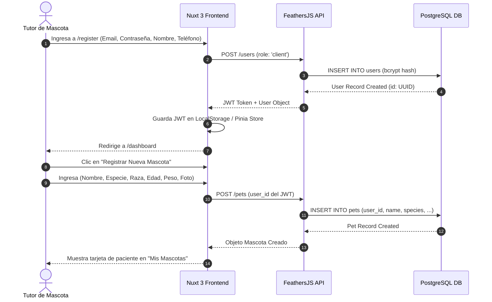
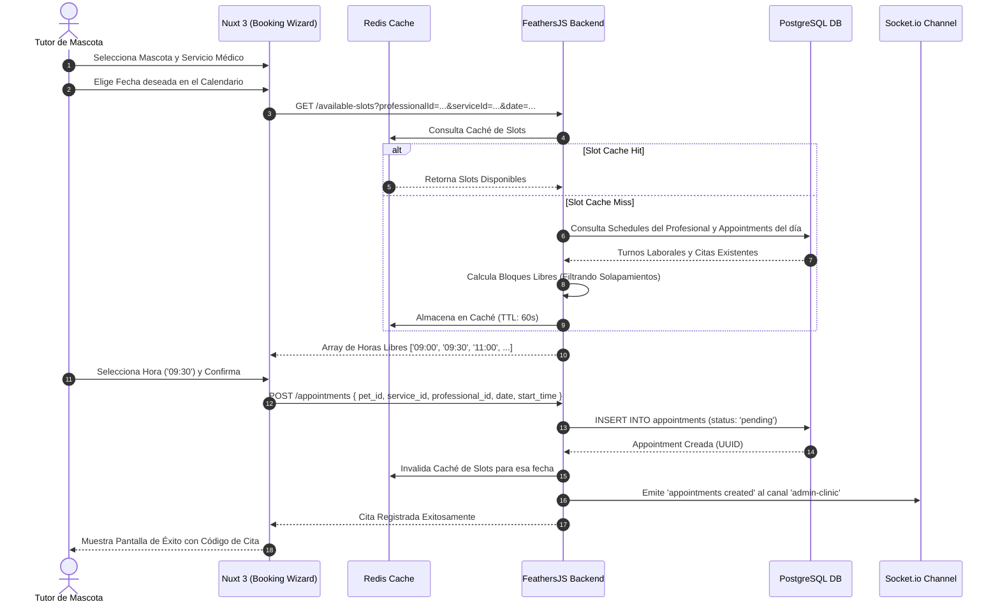
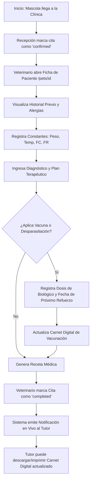
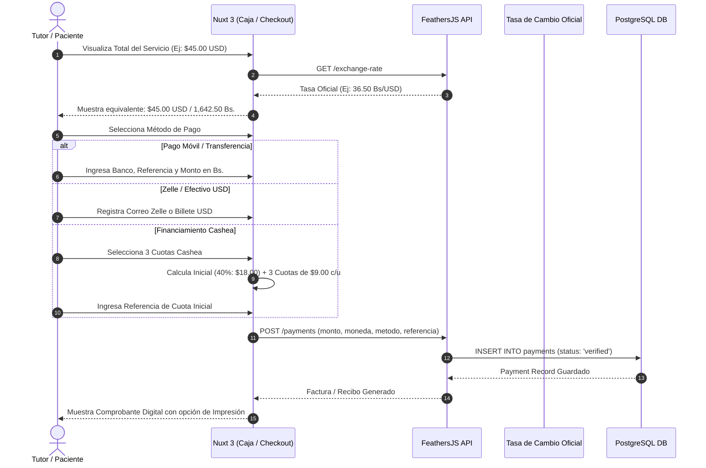
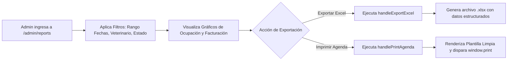

# 4. Application Flow & User Journeys — MedVet v1.0

**Document Version:** 1.0.0  
**Status:** Approved / Active  
**Author:** MedVet Architecture Team  
**Last Updated:** Agosto 2026  

---

## 1. Visión General de los Flujos de la Aplicación

MedVet organiza sus procesos en torno a cinco flujos de trabajo principales:
1. **Flujo 1: Registro, Autenticación y Alta de Mascotas**.
2. **Flujo 2: Agendamiento y Reserva de Citas en Tiempo Real**.
3. **Flujo 3: Atención Clínica, Historia Médica y Carnet de Vacunación**.
4. **Flujo 4: Facturación, Caja y Pasarela Multimoneda (Cashea / Divisas)**.
5. **Flujo 5: Gestión Administrativa y Reportería Gerencial**.

---

## 2. Diagramas de Flujo Detallados (Mermaid)

### Flujo 1: Registro de Tutor y Alta de Paciente

---

### Flujo 2: Agendamiento Inteligente y Reserva de Cita

---

### Flujo 3: Atención Clínica y Carnet de Vacunación

---

### Flujo 4: Facturación y Pasarela de Pagos Multimoneda

---

### Flujo 5: Reportería y Exportación Administrativa

