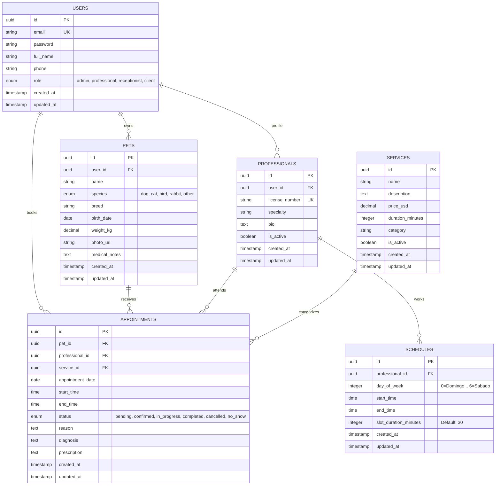

# 5. Backend Schema & Architecture — MedVet v1.0

**Document Version:** 1.0.0  
**Stack:** FeathersJS v5 (Dove) + TypeScript + Knex.js + PostgreSQL 16 + Redis 7  
**Status:** Approved / Active  
**Author:** MedVet Backend Team  
**Last Updated:** Agosto 2026  

---

## 1. Diagrama Entidad-Relación (ERD)



---

## 2. Diccionario de Datos & Especificación de Tablas (PostgreSQL)

### Tabla: `users`
Almacena las credenciales y perfiles de todos los actores del sistema.
* `id` (`UUID`, PK, `DEFAULT gen_random_uuid()`): Identificador único.
* `email` (`VARCHAR(255)`, UNIQUE, NOT NULL): Correo electrónico del usuario.
* `password` (`VARCHAR(255)`, NOT NULL): Hash bcrypt con factor de costo 10.
* `full_name` (`VARCHAR(255)`, NOT NULL): Nombre y apellido del usuario.
* `phone` (`VARCHAR(50)`, NULL): Teléfono de contacto / WhatsApp.
* `role` (`ENUM('admin', 'professional', 'receptionist', 'client')`, NOT NULL, `DEFAULT 'client'`).
* `created_at` / `updated_at` (`TIMESTAMPTZ`, `DEFAULT NOW()`).

### Tabla: `pets`
Registro de pacientes animales vinculados a sus tutores.
* `id` (`UUID`, PK, `DEFAULT gen_random_uuid()`).
* `user_id` (`UUID`, FK -> `users.id`, ON DELETE CASCADE, NOT NULL).
* `name` (`VARCHAR(100)`, NOT NULL): Nombre de la mascota.
* `species` (`ENUM('dog', 'cat', 'bird', 'rabbit', 'other')`, NOT NULL).
* `breed` (`VARCHAR(100)`, NULL): Raza de la mascota.
* `birth_date` (`DATE`, NULL): Fecha de nacimiento aproximada.
* `weight_kg` (`DECIMAL(5,2)`, NULL): Peso en kilogramos.
* `photo_url` (`TEXT`, NULL): URL de la foto de perfil.
* `medical_notes` (`TEXT`, NULL): Alergias o condiciones preexistentes.
* **Índices**: `CREATE INDEX idx_pets_user_id ON pets(user_id);`

### Tabla: `professionals`
Datos médicos y especialidad de los veterinarios.
* `id` (`UUID`, PK, `DEFAULT gen_random_uuid()`).
* `user_id` (`UUID`, FK -> `users.id`, ON DELETE CASCADE, NOT NULL).
* `license_number` (`VARCHAR(100)`, UNIQUE, NOT NULL): Nro. de colegiado / matrícula.
* `specialty` (`VARCHAR(150)`, NOT NULL): Ej. "Cirugía", "Dermatología", "Medicina General".
* `bio` (`TEXT`, NULL): Resumen profesional.
* `is_active` (`BOOLEAN`, `DEFAULT TRUE`).

### Tabla: `schedules`
Definición de turnos laborales regulares por día de la semana.
* `id` (`UUID`, PK, `DEFAULT gen_random_uuid()`).
* `professional_id` (`UUID`, FK -> `professionals.id`, ON DELETE CASCADE, NOT NULL).
* `day_of_week` (`SMALLINT`, NOT NULL): `0` = Domingo, `1` = Lunes, ..., `6` = Sábado.
* `start_time` (`TIME`, NOT NULL): Ej. `08:00:00`.
* `end_time` (`TIME`, NOT NULL): Ej. `17:00:00`.
* `slot_duration_minutes` (`INTEGER`, `DEFAULT 30`).
* **Índices**: `CREATE INDEX idx_schedules_prof_day ON schedules(professional_id, day_of_week);`

### Tabla: `services`
Catálogo de prestaciones veterinarias con precios y duraciones estándar.
* `id` (`UUID`, PK, `DEFAULT gen_random_uuid()`).
* `name` (`VARCHAR(150)`, NOT NULL): Ej. "Consulta General", "Vacunación Antirrábica".
* `description` (`TEXT`, NULL).
* `price_usd` (`DECIMAL(10,2)`, NOT NULL): Precio base en USD.
* `duration_minutes` (`INTEGER`, NOT NULL, `DEFAULT 30`).
* `category` (`VARCHAR(100)`, `DEFAULT 'general'`).
* `is_active` (`BOOLEAN`, `DEFAULT TRUE`).

### Tabla: `appointments`
Registro central de consultas médicas y agendamientos.
* `id` (`UUID`, PK, `DEFAULT gen_random_uuid()`).
* `pet_id` (`UUID`, FK -> `pets.id`, NOT NULL).
* `professional_id` (`UUID`, FK -> `professionals.id`, NOT NULL).
* `service_id` (`UUID`, FK -> `services.id`, NOT NULL).
* `appointment_date` (`DATE`, NOT NULL).
* `start_time` (`TIME`, NOT NULL).
* `end_time` (`TIME`, NOT NULL).
* `status` (`ENUM('pending', 'confirmed', 'in_progress', 'completed', 'cancelled', 'no_show')`, `DEFAULT 'pending'`).
* `reason` (`TEXT`, NULL): Motivo de consulta manifestado por el tutor.
* `diagnosis` (`TEXT`, NULL): Diagnóstico emitido por el veterinario.
* `prescription` (`TEXT`, NULL): Receta e indicaciones terapéuticas.
* **Índices**: `CREATE INDEX idx_appointments_lookup ON appointments(professional_id, appointment_date, status);`

---

## 3. Pipeline de Hooks de FeathersJS (Dove)

FeathersJS procesa cada petición a través de tres etapas secuenciales de middleware/hooks:

```
[ Request In ] 
     │
     ▼
┌────────────────────────┐
│      BEFORE HOOKS      │  -> authenticate('jwt')
│                        │  -> authorizeRoles(['admin', ...])
│                        │  -> validateSchema(joi / typebox)
└───────────┬────────────┘
            │
            ▼
┌────────────────────────┐
│     SERVICE METHOD     │  -> Knex / PostgreSQL DB Transaction
└───────────┬────────────┘
            │
            ▼
┌────────────────────────┐
│      AFTER HOOKS       │  -> protect('password')
│                        │  -> redisCache.invalidate()
│                        │  -> socketIo.emit('event')
└───────────┬────────────┘
            │
            ▼
[ Response Out ]
```

---

## 4. Estrategia de Caché en Redis y WebSockets

1. **Gestión de Turnos Disponibles**:
   - **Clave Redis**: `slots:{professionalId}:{date}`
   - **TTL**: 60 segundos con invalidación inmediata ante creación (`POST /appointments`) o cancelación de citas.
2. **Canales de Socket.io**:
   - `admin-clinic`: Recibe en tiempo real `appointments::created`, `appointments::patched` para alimentar la agenda interactiva sin requerir recargas de página.
   - `client:{userId}`: Recibe notificaciones personalizadas sobre cambios de estado en sus citas y recordatorios de vacunas.
