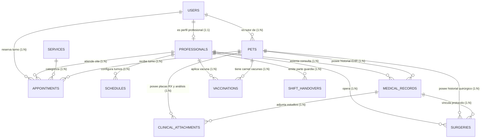

# 5. Backend Schema & Architecture — MedVet v2.0 (EHR & Guardia 24/7)

**Document Version:** 2.0.0  
**Stack:** FeathersJS v5 (Dove) + TypeScript + Knex.js + PostgreSQL 16+ + Redis 7  
**Status:** Approved / Active  
**Author:** MedVet Architecture Team  
**Last Updated:** Agosto 2026  

---

## 1. Diagrama Entidad-Relación Completo (11 Tablas)



---

## 2. Catálogo de Servicios Backend FeathersJS (TypeScript)

| Endpoint / Servicio | Protocolo | Autenticación | Rol Permitido | Descripción |
| :--- | :--- | :--- | :--- | :--- |
| `/authentication` | POST | Local / JWT | Todos | Inicio de sesión y renovación de token JWT |
| `/users` | REST / WS | JWT | `admin`, `client` (self) | Gestión de usuarios y tutores |
| `/professionals` | REST / WS | JWT (Lectura pública) | `admin` | Veterinarios y especialistas |
| `/schedules` | REST / WS | JWT | `admin`, `veterinarian` | Disponibilidad horaria de médicos |
| `/pets` | REST / WS | JWT | `admin`, `veterinarian`, `client` | Fichas de mascotas y pacientes |
| `/services` | REST / WS | JWT (Lectura pública) | `admin` | Catálogo de prestaciones y aranceles |
| `/appointments` | REST / WS | JWT | Todos | Citas, salas de espera y turnos |
| `/medical-records` | REST / WS | JWT | `admin`, `veterinarian` | Consultas, anamnesis, constantes y recetas |
| `/clinical-attachments` | REST / WS | JWT | `admin`, `veterinarian` | Registros de Rayos X, ecografías y laboratorio |
| `/clinical-upload` | POST (REST) | JWT | `admin`, `veterinarian` | Carga optimizada de imágenes RX y PDFs |
| `/vaccinations` | REST / WS | JWT | `admin`, `veterinarian` | Inmunizaciones, lotes y revacunación |
| `/surgeries` | REST / WS | JWT | `admin`, `veterinarian` | Protocolos quirúrgicos, ASA y postoperatorio |
| `/shift-handovers` | REST / WS | JWT | `admin`, `veterinarian` | Partes de guardia 24/7 y relevos médicos |
| `/public-carnet/:id` | GET (REST) | Pública (Sin Auth) | Acceso Universal | Validación instantánea por código QR |

---

## 3. Modelo de Tablas y Restricciones (PostgreSQL)

### 3.1. `medical_records` (Historia Clínica)
- `id` (UUID PK)
- `pet_id` (UUID FK -> `pets.id` ON DELETE CASCADE)
- `professional_id` (UUID FK -> `professionals.id` ON DELETE SET NULL)
- `appointment_id` (UUID FK -> `appointments.id` ON DELETE SET NULL)
- `record_type` (VARCHAR: `consulta`, `control`, `urgencia`, `postquirurgico`, `vacunacion`)
- `reason_for_visit` (TEXT NOT NULL)
- `weight_kg` (DECIMAL(5,2)), `temperature` (DECIMAL(4,2)), `heart_rate` (INT), `respiratory_rate` (INT)
- `mucous_membranes` (VARCHAR), `capillary_refill_time` (VARCHAR)
- `anamnesis` (TEXT), `physical_exam_findings` (TEXT)
- `presumptive_diagnosis` (TEXT), `definitive_diagnosis` (TEXT)
- `treatment_plan` (TEXT), `medical_prescription` (TEXT)
- `patient_status` (VARCHAR: `estable`, `observacion`, `critico`, `hospitalizado`, `prequirurgico`, `postquirurgico`, `alta`)
- `notes` (TEXT)
- `created_at`, `updated_at` (TIMESTAMP)

### 3.2. `clinical_attachments` (Visor RX & Estudios)
- `id` (UUID PK)
- `pet_id` (UUID FK -> `pets.id` ON DELETE CASCADE)
- `medical_record_id` (UUID FK -> `medical_records.id` ON DELETE SET NULL)
- `uploaded_by` (UUID FK -> `users.id` ON DELETE SET NULL)
- `title` (VARCHAR NOT NULL)
- `category` (VARCHAR: `radiografia`, `ecografia`, `sangre`, `orina`, `biopsia`, `informe_medico`, `otro`)
- `file_url` (VARCHAR NOT NULL)
- `thumbnail_url` (VARCHAR)
- `findings` (TEXT)
- `study_date` (DATE)
- `created_at` (TIMESTAMP)

### 3.3. `vaccinations` (Carnet y Sanidad)
- `id` (UUID PK)
- `pet_id` (UUID FK -> `pets.id` ON DELETE CASCADE)
- `professional_id` (UUID FK -> `professionals.id` ON DELETE SET NULL)
- `vaccine_name` (VARCHAR NOT NULL)
- `type` (VARCHAR: `vacuna`, `refuerzo`, `desparasitacion`, `antirrabica`, `otro`)
- `batch_number` (VARCHAR), `manufacturer` (VARCHAR)
- `applied_date` (DATE NOT NULL), `next_due_date` (DATE)
- `status` (VARCHAR: `aplicada`, `pendiente`, `vencida`)
- `notes` (TEXT)
- `created_at` (TIMESTAMP)

### 3.4. `surgeries` (Quirófano)
- `id` (UUID PK)
- `pet_id` (UUID FK -> `pets.id` ON DELETE CASCADE)
- `professional_id` (UUID FK -> `professionals.id` ON DELETE SET NULL)
- `medical_record_id` (UUID FK -> `medical_records.id` ON DELETE SET NULL)
- `surgery_name` (VARCHAR NOT NULL)
- `surgery_type` (VARCHAR: `programada`, `urgencia`, `ambulatoria`, `mayor`, `menor`)
- `pre_op_evaluation` (TEXT - Riesgo ASA)
- `anesthesia_protocol` (TEXT)
- `surgical_technique` (TEXT)
- `post_op_orders` (TEXT)
- `status` (VARCHAR: `programada`, `en_curso`, `completada`, `cancelada`)
- `surgery_date` (TIMESTAMP NOT NULL)
- `created_at`, `updated_at` (TIMESTAMP)

### 3.5. `shift_handovers` (Pase de Guardia 24/7)
- `id` (UUID PK)
- `outgoing_doctor_id` (UUID FK -> `professionals.id` ON DELETE SET NULL)
- `incoming_doctor_id` (UUID FK -> `professionals.id` ON DELETE SET NULL)
- `shift_type` (VARCHAR: `guardia_24h`, `noche`, `manana`, `tarde`)
- `shift_date` (DATE NOT NULL)
- `admitted_patients_count` (INT DEFAULT 0)
- `surgeries_count` (INT DEFAULT 0)
- `emergencies_count` (INT DEFAULT 0)
- `discharges_count` (INT DEFAULT 0)
- `critical_patients_notes` (TEXT)
- `pending_tasks` (TEXT)
- `shift_summary` (TEXT)
- `created_at` (TIMESTAMP)

---

## 4. Migraciones y Versionado con Knex

Las migraciones se ejecutan de manera transaccional:
```bash
npm run migrate # Ejecuta las migraciones 20260812000000 y 20260815000000
npm run seed    # Carga los datos maestros y clínicos de demostración
```
