# 🗄️ MedVet — Esquema y Modelo de Base de Datos Clínico (EHR)

Este documento define la arquitectura relacional, el modelo entidad-relación y la especificación de las 11 tablas de la plataforma **MedVet** (PostgreSQL / Knex / FeathersJS).

El diagrama interactivo editable de Excalidraw se encuentra almacenado en:
📁 [`docs/database-schema.excalidraw`](./database-schema.excalidraw)

---

## 📊 Diagrama Entidad-Relación Integral (Mermaid)

```mermaid
erDiagram
    USERS ||--o| PROFESSIONALS : "1:1 (user_id)"
    USERS ||--o{ PETS : "1:N (user_id)"
    USERS ||--o{ APPOINTMENTS : "1:N (user_id)"
    PROFESSIONALS ||--o{ SCHEDULES : "1:N (professional_id)"
    PROFESSIONALS ||--o{ APPOINTMENTS : "1:N (professional_id)"
    PROFESSIONALS ||--o{ MEDICAL_RECORDS : "1:N (professional_id)"
    PROFESSIONALS ||--o{ VACCINATIONS : "1:N (professional_id)"
    PROFESSIONALS ||--o{ SURGERIES : "1:N (professional_id)"
    PROFESSIONALS ||--o{ SHIFT_HANDOVERS : "1:N (outgoing/incoming)"
    PETS ||--o{ APPOINTMENTS : "1:N (pet_id)"
    PETS ||--o{ MEDICAL_RECORDS : "1:N (pet_id)"
    PETS ||--o{ CLINICAL_ATTACHMENTS : "1:N (pet_id)"
    PETS ||--o{ VACCINATIONS : "1:N (pet_id)"
    PETS ||--o{ SURGERIES : "1:N (pet_id)"
    SERVICES ||--o{ APPOINTMENTS : "1:N (service_id)"
    APPOINTMENTS ||--o| MEDICAL_RECORDS : "1:1 (appointment_id)"
    MEDICAL_RECORDS ||--o{ CLINICAL_ATTACHMENTS : "1:N (medical_record_id)"
    MEDICAL_RECORDS ||--o{ SURGERIES : "1:N (medical_record_id)"

    USERS {
        UUID id PK "gen_random_uuid()"
        VARCHAR email UK "not null, unique"
        VARCHAR password "not null, bcrypt hash"
        VARCHAR name "not null"
        VARCHAR phone "nullable"
        ENUM role "'admin' | 'receptionist' | 'veterinarian' | 'client'"
        BOOLEAN active "default true"
        TIMESTAMP created_at "now()"
        TIMESTAMP updated_at "now()"
    }

    PROFESSIONALS {
        UUID id PK "gen_random_uuid()"
        UUID user_id FK "users.id, unique, CASCADE"
        VARCHAR specialty "not null"
        BOOLEAN active "default true"
        TIMESTAMP created_at "now()"
    }

    SCHEDULES {
        UUID id PK "gen_random_uuid()"
        UUID professional_id FK "professionals.id, CASCADE"
        INTEGER day_of_week "0 = Domingo .. 6 = Sábado"
        TIME start_time "not null"
        TIME end_time "not null"
        BOOLEAN active "default true"
    }

    PETS {
        UUID id PK "gen_random_uuid()"
        UUID user_id FK "users.id, CASCADE"
        VARCHAR name "not null"
        VARCHAR species "not null (Perro, Gato, etc.)"
        VARCHAR breed "nullable"
        INTEGER age "nullable"
        DECIMAL weight "5,2 (kg)"
        VARCHAR photo "URL o ruta de imagen"
        TIMESTAMP created_at "now()"
    }

    SERVICES {
        UUID id PK "gen_random_uuid()"
        VARCHAR name "not null"
        TEXT description "nullable"
        INTEGER duration "duración en minutos"
        DECIMAL price "10,2 (USD)"
        ENUM category "'consulta' | 'vacuna' | 'cirugia' | 'emergencia' | 'estetica' | 'laboratorio'"
        BOOLEAN active "default true"
        TIMESTAMP created_at "now()"
    }

    APPOINTMENTS {
        UUID id PK "gen_random_uuid()"
        UUID user_id FK "users.id, CASCADE"
        UUID pet_id FK "pets.id, CASCADE"
        UUID professional_id FK "professionals.id, CASCADE"
        UUID service_id FK "services.id, CASCADE"
        DATE date "not null"
        TIME start_time "not null"
        TIME end_time "not null"
        ENUM status "'pending' | 'confirmed' | 'completed' | 'cancelled'"
        TEXT notes "observaciones / motivo de consulta"
        TIMESTAMP created_at "now()"
        TIMESTAMP updated_at "now()"
    }

    MEDICAL_RECORDS {
        UUID id PK "gen_random_uuid()"
        UUID pet_id FK "pets.id, CASCADE"
        UUID professional_id FK "professionals.id, SET NULL"
        UUID appointment_id FK "appointments.id, SET NULL"
        VARCHAR record_type "consulta | urgencia | control | hospitalizacion | procedimiento"
        TEXT reason_for_visit "motivo de consulta"
        DECIMAL weight_kg "peso en kg"
        DECIMAL temperature "temperatura corporal en °C"
        INTEGER heart_rate "frecuencia cardíaca en lpm"
        INTEGER respiratory_rate "frecuencia respiratoria en rpm"
        VARCHAR mucous_membranes "mucosas (rosadas, pálidas, etc.)"
        VARCHAR capillary_refill_time "tiempo llenado capilar"
        TEXT anamnesis "historia previa y síntomas"
        TEXT physical_exam_findings "hallazgos del examen físico"
        TEXT presumptive_diagnosis "diagnóstico presuntivo"
        TEXT definitive_diagnosis "diagnóstico definitivo"
        TEXT treatment_plan "plan terapéutico"
        TEXT medical_prescription "receta / indicaciones médicas"
        VARCHAR patient_status "estable | observacion | critico | alta | hospitalizado | prequirurgico | postquirurgico"
        TEXT notes "notas internas"
        TIMESTAMP created_at "now()"
        TIMESTAMP updated_at "now()"
    }

    CLINICAL_ATTACHMENTS {
        UUID id PK "gen_random_uuid()"
        UUID pet_id FK "pets.id, CASCADE"
        UUID medical_record_id FK "medical_records.id, SET NULL"
        VARCHAR category "radiografia | ecografia | sangre | orina | biopsia | informe_escaneado | otro"
        VARCHAR title "título del estudio"
        TEXT findings "informe / hallazgos radiológicos o laboratoriales"
        TEXT file_url "URL del archivo / imagen"
        TEXT thumbnail_url "miniatura para vista rápida"
        VARCHAR file_type "MIME type (image/jpeg, application/pdf)"
        INTEGER file_size "tamaño en bytes"
        DATE study_date "fecha de realización"
        TIMESTAMP created_at "now()"
    }

    VACCINATIONS {
        UUID id PK "gen_random_uuid()"
        UUID pet_id FK "pets.id, CASCADE"
        UUID professional_id FK "professionals.id, SET NULL"
        VARCHAR vaccine_name "nombre de la vacuna / producto"
        VARCHAR type "vacuna | desparasitacion | refuerzo | otro"
        VARCHAR batch_number "número de lote"
        VARCHAR manufacturer "laboratorio fabricante"
        DATE applied_date "fecha de aplicación"
        DATE next_due_date "próximo refuerzo / vencimiento"
        VARCHAR status "aplicada | pendiente | vencida | cancelada"
        TEXT notes "tolerancia o reacciones"
        TIMESTAMP created_at "now()"
    }

    SURGERIES {
        UUID id PK "gen_random_uuid()"
        UUID pet_id FK "pets.id, CASCADE"
        UUID professional_id FK "professionals.id, SET NULL"
        UUID medical_record_id FK "medical_records.id, SET NULL"
        VARCHAR surgery_name "nombre del procedimiento quirúrgico"
        VARCHAR surgery_type "programada | urgencia | ambulatoria | mayor"
        TEXT pre_op_evaluation "evaluación prequirúrgica y riesgo ASA"
        TEXT anesthesia_protocol "protocolo de inducción y mantenimiento"
        TEXT surgical_technique "técnica quirúrgica empleada"
        TEXT post_op_orders "indicaciones y cuidados postoperatorios"
        VARCHAR status "programada | en_quirofano | recuperacion | completada | cancelada"
        TIMESTAMP surgery_date "fecha y hora de la cirugía"
        TIMESTAMP created_at "now()"
        TIMESTAMP updated_at "now()"
    }

    SHIFT_HANDOVERS {
        UUID id PK "gen_random_uuid()"
        UUID outgoing_vet_id FK "professionals.id, SET NULL"
        UUID incoming_vet_id FK "professionals.id, SET NULL"
        VARCHAR shift_type "manana | tarde | noche | guardia_24h"
        DATE shift_date "fecha del turno"
        INTEGER admitted_patients_count "pacientes hospitalizados"
        INTEGER surgeries_count "cirugías del turno"
        INTEGER emergencies_count "urgencias atendidas"
        INTEGER discharges_count "altas otorgadas"
        TEXT critical_patients_notes "pacientes críticos y alertas"
        TEXT pending_tasks "pendientes para el relevo"
        TEXT shift_summary "resumen general de guardia"
        TIMESTAMP created_at "now()"
    }
```

---

## 📑 Diccionario de Datos Extendido (11 Tablas)

### 1. `users` (Usuarios y Autenticación)
| Campo | Tipo | Nulo | Por defecto | Descripción |
| :--- | :--- | :--- | :--- | :--- |
| `id` | `UUID` | No | `gen_random_uuid()` | Clave primaria. |
| `email` | `VARCHAR(255)` | No | — | Correo electrónico único para inicio de sesión. |
| `password` | `VARCHAR(255)` | No | — | Contraseña cifrada con hash seguro (bcrypt). |
| `name` | `VARCHAR(255)` | No | — | Nombre completo del usuario. |
| `phone` | `VARCHAR(50)` | Sí | `NULL` | Teléfono de contacto / WhatsApp. |
| `role` | `ENUM` | No | `'client'` | Roles: `admin`, `receptionist`, `veterinarian`, `client`. |
| `active` | `BOOLEAN` | No | `true` | Estado de la cuenta (activo/inactivo). |
| `created_at`| `TIMESTAMP` | No | `now()` | Fecha y hora de registro. |
| `updated_at`| `TIMESTAMP` | No | `now()` | Fecha y hora de última actualización. |

---

### 2. `professionals` (Veterinarios y Especialistas)
| Campo | Tipo | Nulo | Por defecto | Descripción |
| :--- | :--- | :--- | :--- | :--- |
| `id` | `UUID` | No | `gen_random_uuid()` | Clave primaria. |
| `user_id` | `UUID` | No | — | **FK -> users(id)** con restricción `UNIQUE` y `ON DELETE CASCADE`. |
| `specialty` | `VARCHAR(255)`| No | — | Especialidad médica. |
| `active` | `BOOLEAN` | No | `true` | Disponibilidad del profesional. |
| `created_at`| `TIMESTAMP` | No | `now()` | Fecha de registro. |

---

### 3. `schedules` (Horarios de Atención)
| Campo | Tipo | Nulo | Por defecto | Descripción |
| :--- | :--- | :--- | :--- | :--- |
| `id` | `UUID` | No | `gen_random_uuid()` | Clave primaria. |
| `professional_id` | `UUID` | No | — | **FK -> professionals(id)** con `ON DELETE CASCADE`. |
| `day_of_week` | `INTEGER` | No | — | Día de la semana (0: Domingo .. 6: Sábado). |
| `start_time` | `TIME` | No | — | Hora de inicio de turno. |
| `end_time` | `TIME` | No | — | Hora de fin de turno. |
| `active` | `BOOLEAN` | No | `true` | Estado activo del bloque. |

---

### 4. `pets` (Mascotas / Pacientes)
| Campo | Tipo | Nulo | Por defecto | Descripción |
| :--- | :--- | :--- | :--- | :--- |
| `id` | `UUID` | No | `gen_random_uuid()` | Clave primaria. |
| `user_id` | `UUID` | No | — | **FK -> users(id)** con `ON DELETE CASCADE`. |
| `name` | `VARCHAR(255)`| No | — | Nombre de la mascota. |
| `species` | `VARCHAR(100)`| No | — | Especie (Canino, Felino, etc.). |
| `breed` | `VARCHAR(100)`| Sí | `NULL` | Raza. |
| `age` | `INTEGER` | Sí | `NULL` | Edad en años. |
| `weight` | `DECIMAL(5,2)`| Sí | `NULL` | Peso corporal en kilogramos (kg). |
| `photo` | `VARCHAR(500)`| Sí | `NULL` | Enlace a la foto del paciente. |
| `created_at`| `TIMESTAMP` | No | `now()` | Fecha de registro. |

---

### 5. `services` (Catálogo Clínico)
| Campo | Tipo | Nulo | Por defecto | Descripción |
| :--- | :--- | :--- | :--- | :--- |
| `id` | `UUID` | No | `gen_random_uuid()` | Clave primaria. |
| `name` | `VARCHAR(255)`| No | — | Nombre del servicio. |
| `description` | `TEXT` | Sí | `NULL` | Detalle o alcance. |
| `duration` | `INTEGER` | No | — | Duración en minutos. |
| `price` | `DECIMAL(10,2)`| No | — | Arancel en USD (convertible a Bs vía BCV). |
| `category` | `ENUM` | No | — | Categorías: `consulta`, `vacuna`, `cirugia`, `emergencia`, `estetica`, `laboratorio`. |
| `active` | `BOOLEAN` | No | `true` | Visibilidad en catálogo. |
| `created_at`| `TIMESTAMP` | No | `now()` | Fecha de alta. |

---

### 6. `appointments` (Citas Médicas y Reservas)
| Campo | Tipo | Nulo | Por defecto | Descripción |
| :--- | :--- | :--- | :--- | :--- |
| `id` | `UUID` | No | `gen_random_uuid()` | Clave primaria. |
| `user_id` | `UUID` | No | — | **FK -> users(id)** con `ON DELETE CASCADE`. |
| `pet_id` | `UUID` | No | — | **FK -> pets(id)** con `ON DELETE CASCADE`. |
| `professional_id` | `UUID` | No | — | **FK -> professionals(id)** con `ON DELETE CASCADE`. |
| `service_id` | `UUID` | No | — | **FK -> services(id)** con `ON DELETE CASCADE`. |
| `date` | `DATE` | No | — | Fecha de la cita. |
| `start_time` | `TIME` | No | — | Hora de inicio. |
| `end_time` | `TIME` | No | — | Hora de fin. |
| `status` | `ENUM` | No | `'pending'` | Estados: `pending`, `confirmed`, `completed`, `cancelled`. |
| `notes` | `TEXT` | Sí | `NULL` | Motivo de consulta o notas. |
| `created_at`| `TIMESTAMP` | No | `now()` | Fecha de creación. |
| `updated_at`| `TIMESTAMP` | No | `now()` | Fecha de actualización. |

---

### 7. `medical_records` (Historia Clínica / Consultas EHR)
| Campo | Tipo | Nulo | Por defecto | Descripción |
| :--- | :--- | :--- | :--- | :--- |
| `id` | `UUID` | No | `gen_random_uuid()` | Clave primaria. |
| `pet_id` | `UUID` | No | — | **FK -> pets(id)** con `ON DELETE CASCADE`. |
| `professional_id` | `UUID` | Sí | `NULL` | **FK -> professionals(id)** con `ON DELETE SET NULL`. |
| `appointment_id` | `UUID` | Sí | `NULL` | **FK -> appointments(id)** con `ON DELETE SET NULL`. |
| `record_type` | `VARCHAR(50)` | No | `'consulta'` | Tipos: `consulta`, `urgencia`, `control`, `hospitalizacion`, `procedimiento`. |
| `reason_for_visit` | `TEXT` | Sí | `NULL` | Motivo de la visita. |
| `weight_kg` | `DECIMAL(5,2)`| Sí | `NULL` | Peso al momento de la consulta (kg). |
| `temperature` | `DECIMAL(4,2)`| Sí | `NULL` | Temperatura rectal (°C). |
| `heart_rate` | `INTEGER` | Sí | `NULL` | Frecuencia cardíaca (lpm / bpm). |
| `respiratory_rate` | `INTEGER` | Sí | `NULL` | Frecuencia respiratoria (rpm). |
| `mucous_membranes` | `VARCHAR(50)` | Sí | `NULL` | Estado de mucosas (rosadas, pálidas, etc.). |
| `capillary_refill_time` | `VARCHAR(20)` | Sí | `NULL` | TLLC (ej. < 2 segundos). |
| `anamnesis` | `TEXT` | Sí | `NULL` | Historial previo y síntomas descritos por el tutor. |
| `physical_exam_findings` | `TEXT` | Sí | `NULL` | Hallazgos del examen clínico físico. |
| `presumptive_diagnosis` | `TEXT` | Sí | `NULL` | Diagnóstico presuntivo / diferencial. |
| `definitive_diagnosis` | `TEXT` | Sí | `NULL` | Diagnóstico definitivo confirmado. |
| `treatment_plan` | `TEXT` | Sí | `NULL` | Plan terapéutico / manejo intrahospitalario. |
| `medical_prescription` | `TEXT` | Sí | `NULL` | Receta médica farmacológica e indicaciones. |
| `patient_status` | `VARCHAR(50)` | No | `'estable'` | `estable`, `observacion`, `critico`, `alta`, `hospitalizado`, `prequirurgico`, `postquirurgico`. |
| `notes` | `TEXT` | Sí | `NULL` | Observaciones complementarias. |
| `created_at`| `TIMESTAMP` | No | `now()` | Fecha y hora de consulta. |
| `updated_at`| `TIMESTAMP` | No | `now()` | Fecha de última edición. |

---

### 8. `clinical_attachments` (Estudios, Placas RX, Ecografías e Informes Escaneados)
| Campo | Tipo | Nulo | Por defecto | Descripción |
| :--- | :--- | :--- | :--- | :--- |
| `id` | `UUID` | No | `gen_random_uuid()` | Clave primaria. |
| `pet_id` | `UUID` | No | — | **FK -> pets(id)** con `ON DELETE CASCADE`. |
| `medical_record_id` | `UUID` | Sí | `NULL` | **FK -> medical_records(id)** opcional. |
| `category` | `VARCHAR(50)` | No | — | `radiografia`, `ecografia`, `sangre`, `orina`, `biopsia`, `informe_escaneado`, `otro`. |
| `title` | `VARCHAR(255)`| No | — | Nombre descriptivo del estudio o placa. |
| `findings` | `TEXT` | Sí | `NULL` | Informe radiológico, analítico o diagnóstico. |
| `file_url` | `TEXT` | No | — | URL o ruta de almacenamiento del archivo. |
| `thumbnail_url` | `TEXT` | Sí | `NULL` | URL de miniatura optimizada para previsualización. |
| `file_type` | `VARCHAR(100)`| Sí | `NULL` | Tipo MIME (`image/jpeg`, `application/pdf`, etc.). |
| `file_size` | `INTEGER` | Sí | `NULL` | Tamaño del archivo en bytes. |
| `study_date` | `DATE` | No | `CURRENT_DATE`| Fecha de realización del estudio. |
| `created_at` | `TIMESTAMP` | No | `now()` | Fecha de subida al sistema. |

---

### 9. `vaccinations` (Carnet Digital de Vacunas y Desparasitaciones)
| Campo | Tipo | Nulo | Por defecto | Descripción |
| :--- | :--- | :--- | :--- | :--- |
| `id` | `UUID` | No | `gen_random_uuid()` | Clave primaria. |
| `pet_id` | `UUID` | No | — | **FK -> pets(id)** con `ON DELETE CASCADE`. |
| `professional_id` | `UUID` | Sí | `NULL` | **FK -> professionals(id)** que administró la dosis. |
| `vaccine_name` | `VARCHAR(255)`| No | — | Nombre comercial/genérico del biológico. |
| `type` | `VARCHAR(50)` | No | `'vacuna'` | `vacuna`, `desparasitacion`, `refuerzo`, `otro`. |
| `batch_number` | `VARCHAR(100)`| Sí | `NULL` | Número de lote. |
| `manufacturer` | `VARCHAR(100)`| Sí | `NULL` | Laboratorio farmacéutico. |
| `applied_date` | `DATE` | No | — | Fecha de aplicación. |
| `next_due_date` | `DATE` | Sí | `NULL` | Fecha del próximo refuerzo. |
| `status` | `VARCHAR(50)` | No | `'aplicada'` | `aplicada`, `pendiente`, `vencida`, `cancelada`. |
| `notes` | `TEXT` | Sí | `NULL` | Reacciones posvacunales o notas. |
| `created_at` | `TIMESTAMP` | No | `now()` | Registro en base de datos. |

---

### 10. `surgeries` (Protocolo Quirúrgico)
| Campo | Tipo | Nulo | Por defecto | Descripción |
| :--- | :--- | :--- | :--- | :--- |
| `id` | `UUID` | No | `gen_random_uuid()` | Clave primaria. |
| `pet_id` | `UUID` | No | — | **FK -> pets(id)** con `ON DELETE CASCADE`. |
| `professional_id` | `UUID` | Sí | `NULL` | **FK -> professionals(id)** cirujano principal. |
| `medical_record_id` | `UUID` | Sí | `NULL` | **FK -> medical_records(id)** asociado. |
| `surgery_name` | `VARCHAR(255)`| No | — | Nombre del procedimiento quirúrgico. |
| `surgery_type` | `VARCHAR(50)` | No | `'programada'` | `programada`, `urgencia`, `ambulatoria`, `mayor`. |
| `pre_op_evaluation` | `TEXT` | Sí | `NULL` | Evaluación prequirúrgica y riesgo anestésico. |
| `anesthesia_protocol` | `TEXT` | Sí | `NULL` | Fármacos de inducción, mantenimiento y monitorización. |
| `surgical_technique` | `TEXT` | Sí | `NULL` | Descripción técnica del procedimiento. |
| `post_op_orders` | `TEXT` | Sí | `NULL` | Cuidados y medicación postquirúrgica. |
| `status` | `VARCHAR(50)` | No | `'programada'` | `programada`, `en_quirofano`, `recuperacion`, `completada`, `cancelada`. |
| `surgery_date` | `TIMESTAMP` | No | — | Fecha y hora de intervención. |
| `created_at` | `TIMESTAMP` | No | `now()` | Fecha de registro. |
| `updated_at` | `TIMESTAMP` | No | `now()` | Fecha de modificación. |

---

### 11. `shift_handovers` (Pase de Guardia y Reporte 24/7)
| Campo | Tipo | Nulo | Por defecto | Descripción |
| :--- | :--- | :--- | :--- | :--- |
| `id` | `UUID` | No | `gen_random_uuid()` | Clave primaria. |
| `outgoing_vet_id` | `UUID` | Sí | `NULL` | **FK -> professionals(id)** veterinario saliente. |
| `incoming_vet_id` | `UUID` | Sí | `NULL` | **FK -> professionals(id)** veterinario entrante. |
| `shift_type` | `VARCHAR(50)` | No | — | `manana`, `tarde`, `noche`, `guardia_24h`. |
| `shift_date` | `DATE` | No | — | Fecha del turno de guardia. |
| `admitted_patients_count`| `INTEGER`| No | `0` | Pacientes ingresados/hospitalizados. |
| `surgeries_count` | `INTEGER` | No | `0` | Cirugías efectuadas en el turno. |
| `emergencies_count` | `INTEGER` | No | `0` | Urgencias atendidas. |
| `discharges_count` | `INTEGER` | No | `0` | Altas médicas firmadas. |
| `critical_patients_notes`| `TEXT` | Sí | `NULL` | Estado de pacientes en estado crítico y tratamientos en curso. |
| `pending_tasks` | `TEXT` | Sí | `NULL` | Tareas pendientes y revisiones para el siguiente turno. |
| `shift_summary` | `TEXT` | Sí | `NULL` | Resumen ejecutivo del turno. |
| `created_at` | `TIMESTAMP` | No | `now()` | Fecha de emisión del parte médico. |

---

## ⚡ Índices de Rendimiento (PostgreSQL)

1. `idx_pets_user_id` en `pets(user_id)`
2. `idx_professionals_user_id` en `professionals(user_id)`
3. `idx_schedules_professional_id` en `schedules(professional_id)`
4. `idx_appointments_user_id` en `appointments(user_id)`
5. `idx_appointments_professional_id` en `appointments(professional_id)`
6. `idx_appointments_date` en `appointments(date)`
7. `idx_medical_records_pet_id` en `medical_records(pet_id)`
8. `idx_medical_records_patient_status` en `medical_records(patient_status)`
9. `idx_clinical_attachments_pet_id` en `clinical_attachments(pet_id)`
10. `idx_clinical_attachments_category` en `clinical_attachments(category)`
11. `idx_vaccinations_pet_id` en `vaccinations(pet_id)`
12. `idx_vaccinations_next_due_date` en `vaccinations(next_due_date)`
13. `idx_surgeries_pet_id` en `surgeries(pet_id)`
14. `idx_surgeries_status` en `surgeries(status)`
15. `idx_shift_handovers_shift_date` en `shift_handovers(shift_date)`
