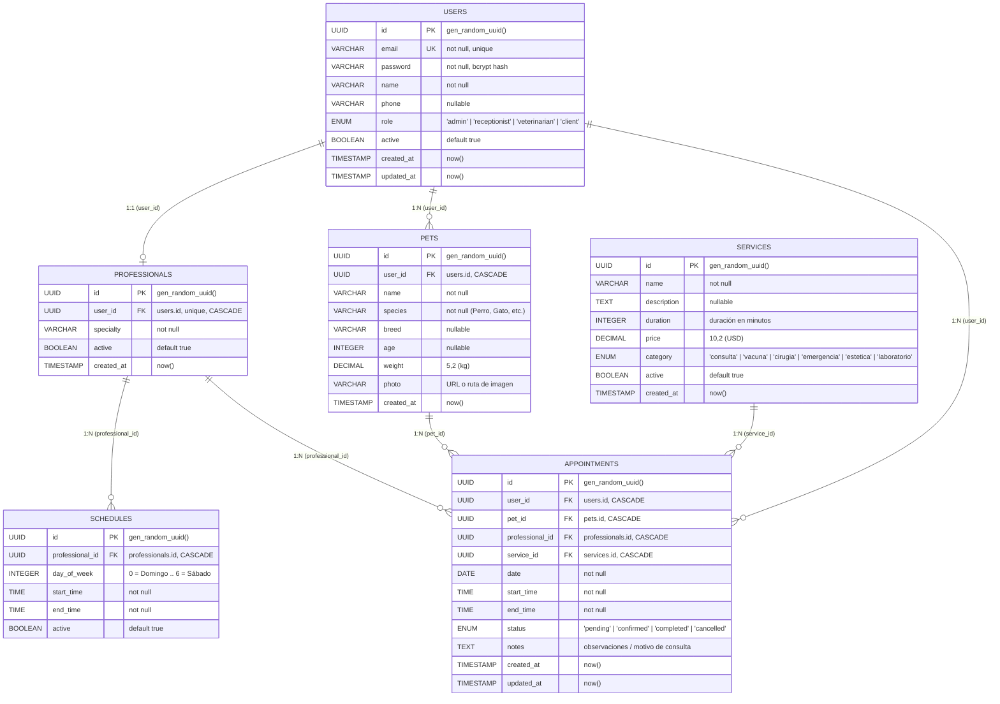

# 🗄️ MedVet — Esquema y Modelo de Base de Datos

Este documento define la arquitectura relacional, el modelo entidad-relación y la especificación de tablas de la plataforma **MedVet** (PostgreSQL / Knex / FeathersJS).

El diagrama interactivo editable de Excalidraw se encuentra almacenado en:
📁 [`docs/database-schema.excalidraw`](./database-schema.excalidraw)

---

## 📊 Diagrama Entidad-Relación (Mermaid)

---

## 📑 Diccionario de Datos

### 1. `users` (Usuarios y Autenticación)
Almacena todos los actores del sistema: clientes/propietarios, recepcionistas, veterinarios y administradores.

| Campo | Tipo | Nulo | Por defecto | Descripción |
| :--- | :--- | :--- | :--- | :--- |
| `id` | `UUID` | No | `gen_random_uuid()` | Clave primaria. |
| `email` | `VARCHAR(255)` | No | — | Correo electrónico único para inicio de sesión. |
| `password` | `VARCHAR(255)` | No | — | Contraseña cifrada con hash seguro (bcrypt/argon2). |
| `name` | `VARCHAR(255)` | No | — | Nombre completo del usuario. |
| `phone` | `VARCHAR(50)` | Sí | `NULL` | Teléfono de contacto / WhatsApp. |
| `role` | `ENUM` | No | `'client'` | Roles: `admin`, `receptionist`, `veterinarian`, `client`. |
| `active` | `BOOLEAN` | No | `true` | Estado de la cuenta (activo/inactivo). |
| `created_at`| `TIMESTAMP` | No | `now()` | Fecha y hora de registro. |
| `updated_at`| `TIMESTAMP` | No | `now()` | Fecha y hora de última actualización. |

---

### 2. `professionals` (Veterinarios y Especialistas)
Extiende el perfil de un usuario con rol de veterinario para vincular su especialidad médica y turnos.

| Campo | Tipo | Nulo | Por defecto | Descripción |
| :--- | :--- | :--- | :--- | :--- |
| `id` | `UUID` | No | `gen_random_uuid()` | Clave primaria. |
| `user_id` | `UUID` | No | — | **FK -> users(id)** con restricción `UNIQUE` y `ON DELETE CASCADE`. |
| `specialty` | `VARCHAR(255)`| No | — | Especialidad (Medicina General, Cirugía, Cardiología, etc.). |
| `active` | `BOOLEAN` | No | `true` | Disponibilidad del profesional para citas. |
| `created_at`| `TIMESTAMP` | No | `now()` | Fecha de registro. |

---

### 3. `schedules` (Horarios de Atención)
Define las franjas de disponibilidad semanal por cada profesional veterinario.

| Campo | Tipo | Nulo | Por defecto | Descripción |
| :--- | :--- | :--- | :--- | :--- |
| `id` | `UUID` | No | `gen_random_uuid()` | Clave primaria. |
| `professional_id` | `UUID` | No | — | **FK -> professionals(id)** con `ON DELETE CASCADE`. |
| `day_of_week` | `INTEGER` | No | — | Día de la semana (0: Domingo, 1: Lunes ... 6: Sábado). |
| `start_time` | `TIME` | No | — | Hora de inicio de turno (ej. `08:00:00`). |
| `end_time` | `TIME` | No | — | Hora de fin de turno (ej. `17:00:00`). |
| `active` | `BOOLEAN` | No | `true` | Estado activo del bloque de horario. |

---

### 4. `pets` (Mascotas / Pacientes)
Registra las mascotas pertenecientes a cada cliente.

| Campo | Tipo | Nulo | Por defecto | Descripción |
| :--- | :--- | :--- | :--- | :--- |
| `id` | `UUID` | No | `gen_random_uuid()` | Clave primaria. |
| `user_id` | `UUID` | No | — | **FK -> users(id)** (Propietario) con `ON DELETE CASCADE`. |
| `name` | `VARCHAR(255)`| No | — | Nombre de la mascota. |
| `species` | `VARCHAR(100)`| No | — | Especie (Canino, Felino, Ave, etc.). |
| `breed` | `VARCHAR(100)`| Sí | `NULL` | Raza. |
| `age` | `INTEGER` | Sí | `NULL` | Edad en años. |
| `weight` | `DECIMAL(5,2)`| Sí | `NULL` | Peso corporal en kilogramos (kg). |
| `photo` | `VARCHAR(500)`| Sí | `NULL` | Enlace / URL a la foto de la mascota. |
| `created_at`| `TIMESTAMP` | No | `now()` | Fecha de registro. |

---

### 5. `services` (Catálogo Clínico)
Listado de prestaciones médicas y asistenciales ofrecidas por la clínica veterinaria.

| Campo | Tipo | Nulo | Por defecto | Descripción |
| :--- | :--- | :--- | :--- | :--- |
| `id` | `UUID` | No | `gen_random_uuid()` | Clave primaria. |
| `name` | `VARCHAR(255)`| No | — | Nombre del servicio (ej. "Consulta General"). |
| `description` | `TEXT` | Sí | `NULL` | Detalle o alcance del servicio. |
| `duration` | `INTEGER` | No | — | Duración estimada en minutos. |
| `price` | `DECIMAL(10,2)`| No | — | Arancel en USD (convertible a Bs vía BCV). |
| `category` | `ENUM` | No | — | Categorías: `consulta`, `vacuna`, `cirugia`, `emergencia`, `estetica`, `laboratorio`. |
| `active` | `BOOLEAN` | No | `true` | Visibilidad en el catálogo de reservas. |
| `created_at`| `TIMESTAMP` | No | `now()` | Fecha de alta del servicio. |

---

### 6. `appointments` (Citas Médicas y Reservas)
Entidad transaccional central que vincula al cliente, la mascota, el veterinario y el servicio solicitado.

| Campo | Tipo | Nulo | Por defecto | Descripción |
| :--- | :--- | :--- | :--- | :--- |
| `id` | `UUID` | No | `gen_random_uuid()` | Clave primaria. |
| `user_id` | `UUID` | No | — | **FK -> users(id)** con `ON DELETE CASCADE`. |
| `pet_id` | `UUID` | No | — | **FK -> pets(id)** con `ON DELETE CASCADE`. |
| `professional_id` | `UUID` | No | — | **FK -> professionals(id)** con `ON DELETE CASCADE`. |
| `service_id` | `UUID` | No | — | **FK -> services(id)** con `ON DELETE CASCADE`. |
| `date` | `DATE` | No | — | Fecha de la cita (`YYYY-MM-DD`). |
| `start_time` | `TIME` | No | — | Hora de inicio (`HH:MM:SS`). |
| `end_time` | `TIME` | No | — | Hora de fin calculada según la duración del servicio. |
| `status` | `ENUM` | No | `'pending'` | Estados: `pending`, `confirmed`, `completed`, `cancelled`. |
| `notes` | `TEXT` | Sí | `NULL` | Motivo de consulta o notas clínicas adicionales. |
| `created_at`| `TIMESTAMP` | No | `now()` | Fecha y hora de creación de la reserva. |
| `updated_at`| `TIMESTAMP` | No | `now()` | Fecha y hora de última modificación. |

---

## ⚡ Índices de Rendimiento (PostgreSQL)

Para garantizar consultas ultrarrápidas y disponibilidad en tiempo real, se encuentran indexados:

1. `idx_pets_user_id` en `pets(user_id)`
2. `idx_professionals_user_id` en `professionals(user_id)`
3. `idx_schedules_professional_id` en `schedules(professional_id)`
4. `idx_appointments_user_id` en `appointments(user_id)`
5. `idx_appointments_professional_id` en `appointments(professional_id)`
6. `idx_appointments_date` en `appointments(date)`
7. `idx_appointments_status` en `appointments(status)`

---

## 🎨 Cómo Abrir y Editar el Diagrama Excalidraw

1. Puedes abrir [Excalidraw Web](https://excalidraw.com) y arrastrar el archivo [`docs/database-schema.excalidraw`](./database-schema.excalidraw).
2. O visualizarlo directamente en VSCode / IDE instalando la extensión oficial de **Excalidraw**.
